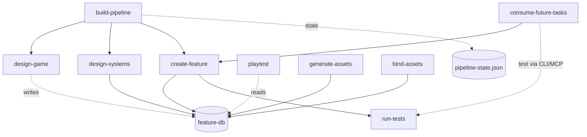

# SisterGame Claude Code Skills

本プロジェクトで運用している Claude Code スキルの一覧と依存グラフ。
公式の declarative skill dependency は未実装（[Issue #27113](https://github.com/anthropics/claude-code/issues/27113) で議論中）のため、**本ドキュメントが人間向けの依存宣言**として機能する。

## 設計原則

1. **Primitive skill は他 skill を呼ばない**（依存ゼロを維持）
2. **Composition skill（上位オーケストレータ）のみが他 skill を呼ぶ**
3. **Skill 同士の直接呼び出しは最小化**。Claude（モデル）がオーケストレータとなり、各 skill の出力を読んで次の呼び出しを判断する
4. **共通の入力/出力フォーマット**（feature-db、pipeline-state.json、designs/*.md）で skill 間の疎結合を保つ

## スキル分類

### Composition（オーケストレータ）

他 skill を呼び出して複雑ワークフローを回す。

| スキル | 主な呼び出し先 |
|--------|--------------|
| `build-pipeline` | `design-game` → `design-systems` → `create-feature` |
| `consume-future-tasks` | `create-feature`（Agent 並列）、`run-tests` |
| `playtest` | `unicli`、直接 Unity CLI/MCP（`run-tests` は呼ばない） |

### Design（設計・計画）

| スキル | 入力 | 出力 |
|--------|------|------|
| `design-game` | コンセプト | `designs/game-design.md`, `designs/asset-spec.json` |
| `design-systems` | セクション | `designs/systems/*.md`, `feature-db` 登録、`designs/sprints/*.md`（旧 `plan-sprint` 統合） |
| `design-stage` | ステージコンセプト | `designs/stages/*.md` |

### Implementation（実装）

| スキル | 入力 | 出力 |
|--------|------|------|
| `create-feature` | 機能名 | テスト + 実装コード、feature-db 更新 |
| `create-event` | 会話データ | Timeline + Dialog UI |
| `create-ui` | UI仕様 | UXML/USS + backing script |

### Verification（検証）

| スキル | 入力 | 出力 |
|--------|------|------|
| `run-tests` | テスト対象 | TestResults.xml, feature-db 更新（Primitive） |
| `playtest` | 機能リスト | 総合レポート、バグ修正コミット |
| `validate-scene` | シーン | 整合性レポート |
| `debug-assist` | 問題描写 | 原因分析 + 修正案 |
| `simplify` | コード変更 | 改善コミット |

### Assets（アセット）

| スキル | 入力 | 出力 |
|--------|------|------|
| `generate-assets` | pending アセット | 画像生成（Kaggle）/ 音声マッチング、音声インデックス管理内包 |
| `generate-char-designs` | キャラ設定 | キャラデザ案（Flanime + ComfyUI） |
| `bind-assets` | 本番アセット | プレースホルダー差し替え |

### Stage/Content

| スキル | 用途 |
|--------|------|
| `adjust-stage` | ステージ調整 + 学習ノート記録 |
| `manage-flags` | グローバル/マップローカルフラグ管理 |
| `create-balance-sheet` | バランスデータ CSV/Excel |
| `create-map-reference` | ステージ設計 HTML 視覚ガイド |

### Auxiliary（補助・オプション）

パイプラインフロー外。人間判断で呼ぶ。

| スキル | 用途 |
|--------|------|
| `drawio` | draw.io 図生成 |
| `test-game-ml` | ML-Agents プレイテスト（環境準備コストあり） |
| `build-game` | 最終ビルド実行 |
| `unicli` | Unity Editor CLI 直接操作 |

## 依存グラフ（Mermaid）

## 循環依存の回避

- Skill は runtime が循環依存を検出した場合に abort する（`currently loading` セットによる検知）
- 新規 skill 追加時は**他 skill を呼ばない primitive から始め**、必要に応じて composition skill に昇格させる
- 既存の composition skill（`build-pipeline` / `consume-future-tasks` / `playtest`）が肥大化した場合は、内部ステップを別 skill に抽出するより、**reference ドキュメント**（`references/*.md`）に切り出す（`playtest/references/test-types/t*.md` の方式を踏襲）

## 参考

- [Skill Collaboration Pattern](https://www.mindstudio.ai/blog/claude-code-skill-collaboration-pattern)
- [Extend Claude with skills（公式）](https://code.claude.com/docs/en/skills)
- [Declarative skill dependencies proposal (Issue #27113)](https://github.com/anthropics/claude-code/issues/27113)
